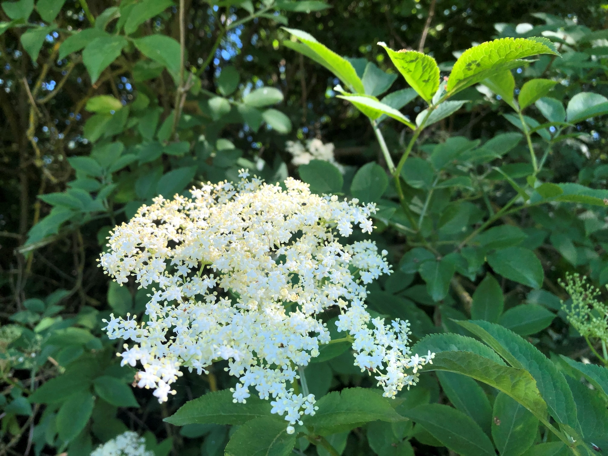

## Топ-10 коктейлей с ликёром из цветков бузины

### 1. [Comte de Sureau](https://www.diffordsguide.com/cocktails/recipe/7257/comte-de-sureau)
- __Elderflower liqueur__
- London dry gin
- Red bitter liqueur (Campari)

### 2. [Ernest + Rita](https://www.diffordsguide.com/cocktails/recipe/9418/ernest--rita)
- __Elderflower liqueur__
- Silver blanco tequila
- Grapefruit juice
- Lime juice
- Sugar syrup

### 3. [Sunflower](https://www.diffordsguide.com/cocktails/recipe/5807/sunflower)
- __Elderflower liqueur__
- London dry gin
- Triple Sec
- Lemon juice
- Absinthe (optional)

### 4. [Amber Room No. 2](https://www.diffordsguide.com/cocktails/recipe/2242/amber-room-no-2)
- __Elderflower liqueur__
- London dry gin
- Red dry vermouth
- Orange bitter (Angostura)

### 5. [Old Friend](https://www.diffordsguide.com/cocktails/recipe/4258/old-friend)
- __Elderflower liqueur__
- London dry gin
- Red bitter liqueur (Campari)
- Grapefruit juice

### 6. [Elderflower Spritz](https://www.diffordsguide.com/cocktails/recipe/2743/elderflower-spritz)
- __Elderflower liqueur__
- White dry wine (Sauvignon blanc)
- Soda

### 7. [Irish Maid](https://www.diffordsguide.com/your/favourites?include_cocktails=1&include_bws=1&include_ingredients=1&limit=12)
- __Elderflower liqueur__
- Irish whiskey
- Lemon juice
- Sugar syrup
- Cucumber

### 8. [Left Bank Martini](https://www.diffordsguide.com/cocktails/recipe/2464/left-bank-martini)
- __Elderflower liqueur__
- London dry gin
- White dry wine (Chablis)
- Dry vermouth (Strucchi/Campari)

### 9. [Ruby](https://www.diffordsguide.com/cocktails/recipe/6392/ruby)
- __Elderflower liqueur__
- Vodka
- Aperitivo (Aperol)
- Grapefruit juice
- Lemon juice
- Egg white (foamer, optional)

### 10. [Courtside](https://www.diffordsguide.com/cocktails/recipe/4198/courtside)
- __Elderflower liqueur__
- Vodka
- Apple juice
- Lime juice
- Sugar syrup
- Soda
- Strawberries & raspberries (garnish, optional)
